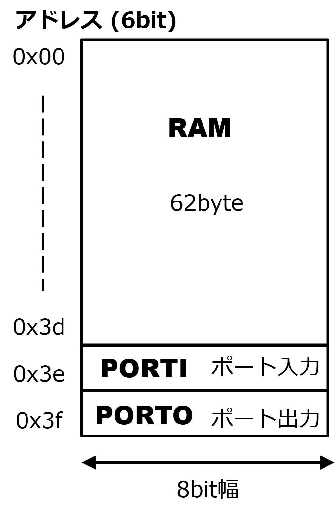
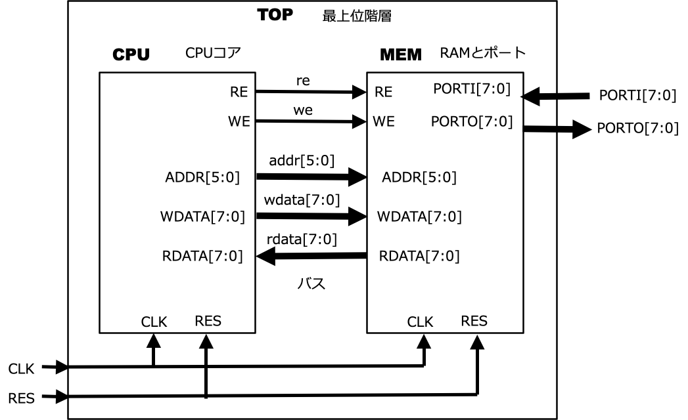
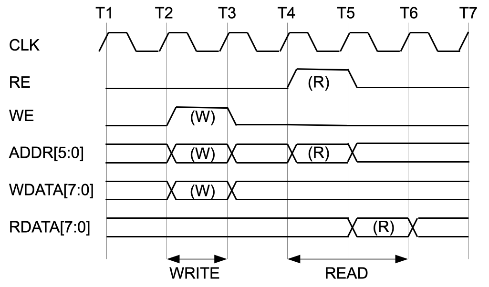

# Simple CPU "picoCPU"

## The Essence of Chip Design: CPU Logic Design

The ultimate path in logic design is to build your own CPU. In this project, we define the "picoCPU"—a CPU with a simple instruction set—explain how to write its RTL in the hardware description language SystemVerilog, and trace its behavior through logic simulation. The CPU we are designing here is an 8-bit processor with only four instructions, specifically optimized for "LED blinking" (L-Chika) tasks.

## picoCPU Instruction Set Architecture (ISA)

This section explains the Instruction Set Architecture of the picoCPU. The internal CPU resources visible to the programmer are called the "Programmer's Model," and the model for the picoCPU is shown in Figure 1. It consists only of a 6-bit Program Counter (PC) and an 8-bit "A" register for data storage. The memory for this CPU is a 64-byte space addressable by a 6-bit address, where both instructions and data reside in the same space. After a reset, the PC is initialized to 0, and execution begins from the instruction at address 0.


*Figure 1: picoCPU Programmer's Model*

The instruction set is shown in Table 1. Each instruction is an 8-bit code where the upper 2 bits represent the opcode (indicating the operation) and the lower 6 bits represent the operand (indicating the target of the process).

*   **ADD**: Adds the lower 6 bits of the instruction code (sign-extended) to the A register.
*   **JNZ (Jump if Not Zero)**: If the A register is not zero, the lower 6 bits of the instruction code are transferred to the PC to perform a jump. If the A register is zero, it proceeds to the next instruction without jumping.
*   **LDA (Load A)**: Reads data from the memory address specified by the lower 6 bits and stores it in the A register.
*   **STA (Store A)**: Writes the contents of the A register into the memory address specified by the lower 6 bits.

*Table 1: picoCPU Instruction Set*

| Instruction | Opcode (2 bits) | Operand (6 bits) | Description |
| :--- | :--- | :--- | :--- |
| **ADD** | 00 | Immediate | A = A + SignExt(Imm) |
| **JNZ** | 01 | Target Address | if (A != 0) PC = Target |
| **LDA** | 10 | Memory Address | A = Memory[Addr] |
| **STA** | 11 | Memory Address | Memory[Addr] = A |

## Memory Space and I/O Ports

The memory map is shown in Figure 2. The memory space consists of 64 bytes in total, with the last 2 bytes assigned as control registers for I/O ports: an 8-bit independent input port (PORTI) and an 8-bit output port (PORTO). The input level of PORTI can be read from address 0x3E, and the output level of PORTO can be set by writing to address 0x3F.



*Figure 2: picoCPU Memory Map*

## Block Diagram of the picoCPU System

Figure 3 shows the block diagram of the picoCPU system. The CPU and MEM blocks are contained under the top-level hierarchy, TOP. The MEM block consists of the main memory and I/O ports that make up the memory map shown in Figure 2. Although the memory is implemented as RAM, its contents are initialized with program code before running a logic simulation.



*Figure 3: picoCPU System Block Diagram*

## Bus Access Timing

In a typical system, multiple memories and peripheral functions are connected to the CPU via a bus. In this article, although only the MEM module is connected to the CPU, they are still linked by a bus. The bus timing is shown in Figure 4.

**Write access** completes in a single cycle by asserting the write enable (WE), address (ADDR), and write data (WDATA) starting at time T2.

**Read access** asserts the read enable (RE) and address (ADDR) at time T4, and outputs the read data (RDATA) starting from the following time T5. No wait-state functionality is implemented.



*Figure 4: picoCPU Bus Timing*

## Preparing the Design Files

You can download the complete set of files using the following command:

```bash
$ git clone https://github.com/munetomo-maruyama/picoCPU.git

Please ensure that at least the following files are present:
```
picoCPU/
├── RTL             Directory for RTL descriptions
│   ├── cpu.sv          CPU RTL description
│   ├── mem.sv          MEM RTL description
│   └── top.sv          Top-level hierarchy RTL description
└── SIM             Directory for logic simulation execution
    ├── flist.txt       File list
    ├── go_sim          Execution script
    ├── tb.gtkw         Waveform viewer display format
    └── tb.sv           Testbench
```

## SystemVerilog Description of the Top-Level Module (TOP)

The RTL description of the top-level module is `RtL/top.sv`. The external I/O signals consist of the clock (`CLK`), a reset (`RES`, active-high), and 8-bit wide port interfaces (`PORTI` and `PORTO`). Within the TOP hierarchy, the `CPU` and `MEM` modules are instantiated.


## SystemVerilog Description of the CPU Module

The RTL description of the CPU module is `RTL/cpu.sv`. When designing logic circuits, it is best practice to separate the design into a **Data Path** unit (which describes the flow of data) and a **Control Unit** (which manages that flow).

The picoCPU follows this structure. The first half, the Data Path, defines only the structural elements for data flow, such as internal CPU resources (PC, A register, etc.) and their respective control signals, leaving the detailed logic to the Control Unit.

The Control Unit is implemented as a **State Machine**. The picoCPU consists of 8 states (represented by a 3-bit `state` variable), which are defined using `` `define `` statements at the beginning of the code. The `state` transitions on every rising edge of the clock (`CLK`), with the next state prepared in `state_next`. The `state_next` logic is described using `always_comb` as a combinational circuit based on the current state and various input signals. Signals that control the Data Path are generated simultaneously within this logic.


## SystemVerilog Description of the MEM Module

Since there is no dedicated development environment, the programs in memory are created through **hand-assembly**. An example program is shown in Listing 1. In this operation, if the `PORTI` input (address 0x3E) is `0x00`, the `PORTO` output (address 0x3F) increments at regular intervals. If the `PORTI` input is anything other than `0x00`, the change in `PORTO` output stops. The data at addresses 0x20 and 0x21 are constants; the value at 0x21 determines the interval of the `PORTO` output changes. If any of the `PORTO` outputs are connected to LEDs, this results in an "LED blinking" (blinkLED/L-Chika) effect. The memory contents are initialized using an `initial` statement according to this list.

*Listing 1: picoCPU Program Example (blinkLED)*
```asm
-----------------------------
ADDR CODE LABEL   MNEMONIC
-----------------------------
0x00 0xbe START   LDA  @PORTI
0x01 0x40         JNZ  @START
0x02 0xa1 INIT    LDA  @TEN
0x03 0x3f LOOP    ADD  #-1
0x04 0x43         JNZ  @LOOP
0x05 0xbf OUT     LDA  @POUT
0x06 0x01         ADD  #1
0x07 0xff         STA  @POUT
0x08 0xa0 RESTART LDA  @ONE
0x09 0x40         JNZ  @START

0x20 0x01 ONE     CONST 0x01
0x21 0x0a TEN     CONST 0X0a

0x3e 0x00 PORTI   DATA   0x00
0x3f 0x00 PORTO   DATA   0x00 
-----------------------------
```

The RTL description of the MEM module is `RTL/mem.sv`. The memory is defined as a 64-byte RAM using an array variable `logic [7:0] mem[0:63]`. Addresses 0x3E (62) and 0x3F (63) are replaced by logic for the port interfaces.

## Running the Logic Simulation

Before running, ensure the execution permission is granted to the `go_sim` file using `chmod`. You can start the logic simulation by executing the following command within the `SIM` directory:

```bash
cd SIM
./go_sim
```

When Icarus Verilog executes the simulation, it first compiles the RTL descriptions using the iverilog command to generate the `tb.vvp` file. Then, it inputs this file into the `vvp` command to run the simulation engine. The simulation generates a waveform file `tb.vcd`, and the message outputs are stored in the log file named `log`.

## Verifying the Waveform File

To verify the waveform file, use the following commands. If you do not have a waveform configuration file, run:

```bash
gtkwave tb.vcd
```

If you have a waveform configuration file (tb.gtkw), run:

```bash
gtkwave tb.vcd tb.gtkw
```

An example of the waveform display is shown in Figure 5. Clicking on a logic hierarchy in the upper-left pane displays the signals for that hierarchy in the lower-left pane. You can add these signals to the waveform area on the right using the Append or Insert buttons. The currently displayed waveforms and their order can be saved to a configuration file via `File > Write Save File As`. The buttons at the top of the screen allow for zooming in/out and navigating through the time axis. Please explore the interface to familiarize yourself with its usage.
As described in the program in Listing 1, the behavior of `PORTO` relative to the `PORTI` input is as expected. While `PORTI` is 0x00, `PORTO` continues to increment.


*Figure 5: Simulation waveforms displayed in GTKWave*

## Take on the Challenge of CPU Design!

Whether it is a custom instruction set or the RISC-V ISA, designing a CPU offers immense learning opportunities. The sense of accomplishment when it finally works is truly irreplaceable. I highly encourage you to take on the challenge!


